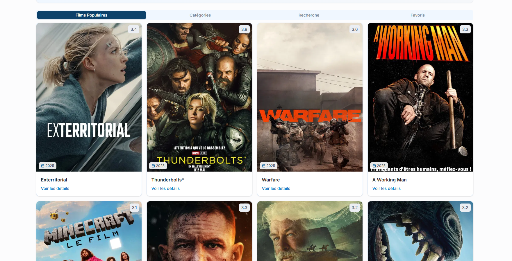

# 🎬 MovieSprint

**Un laboratoire Next.js pour explorer les bonnes pratiques de TanStack Query**  
_"Par la pratique vient la maîtrise" - Une sagesse développeur_

 <!-- Ajoutez votre propre capture -->

## 🧪 Concept du Projet

Un terrain de jeu pédagogique pour expérimenter avec **TanStack Query v5** dans un contexte Next.js 14.

## ✨ Fonctionnalités

- 🔍 Recherche de films avec suggestions en temps réel
- 🎥 Affichage des films populaires/tendances par catégorie
- ♾️ Chargement infini avec scroll infini
- ⭐ Système de favoris (via LocalStorage)
- 📦 Cache intelligent
  - Stale-while-revalidate
  - préchargement et garbage collection
- 🚀 Optimisation des performances avec :
  - Cache intelligent (TanStack Query)
  - SSR/SSG (Next.js)
  - Virtualisation des listes

## 🛠️ Tech Stack

- **Framework** : Next.js 14
- **Styling** : Tailwind CSS + Shadcn/ui
- **State Management** : TanStack Query v5
- **UI Components** : Radix UI + Lucide Icons
- **Tooling** : TypeScript, ESLint, PostCSS
